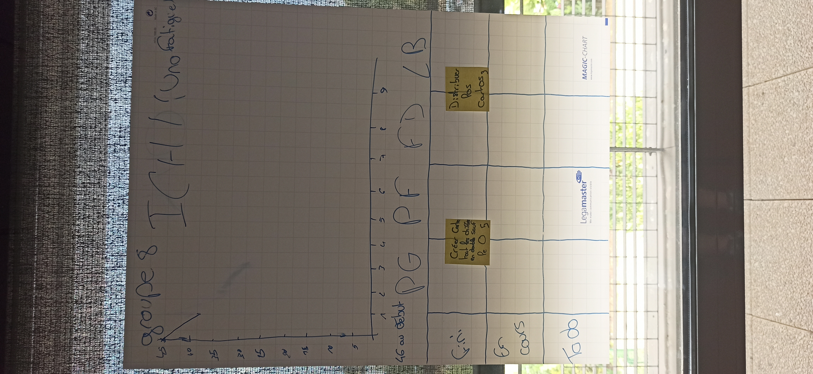
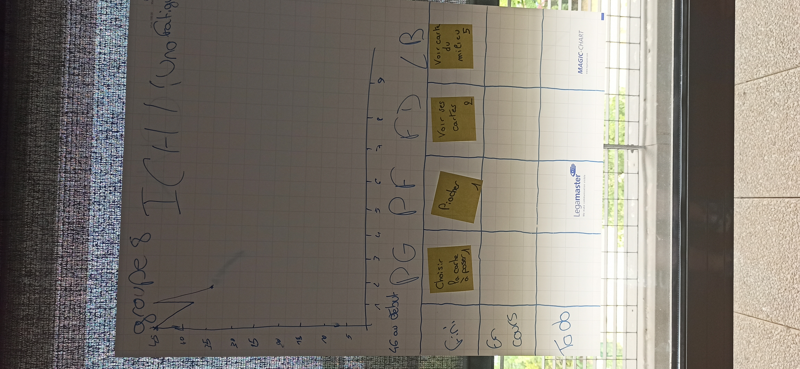
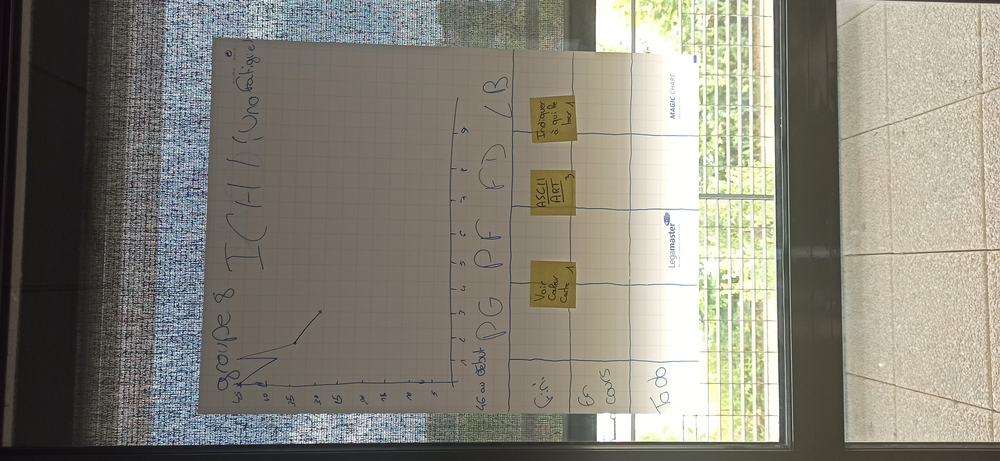
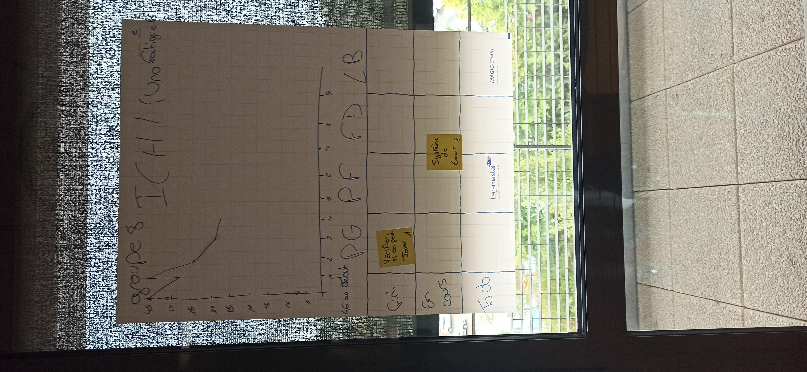
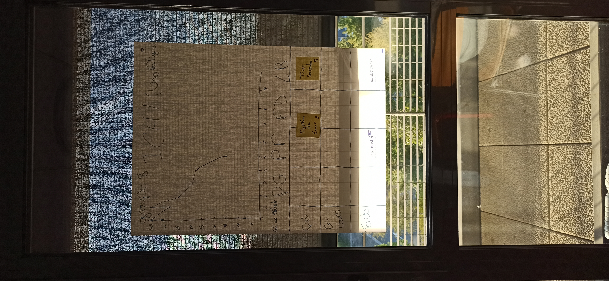
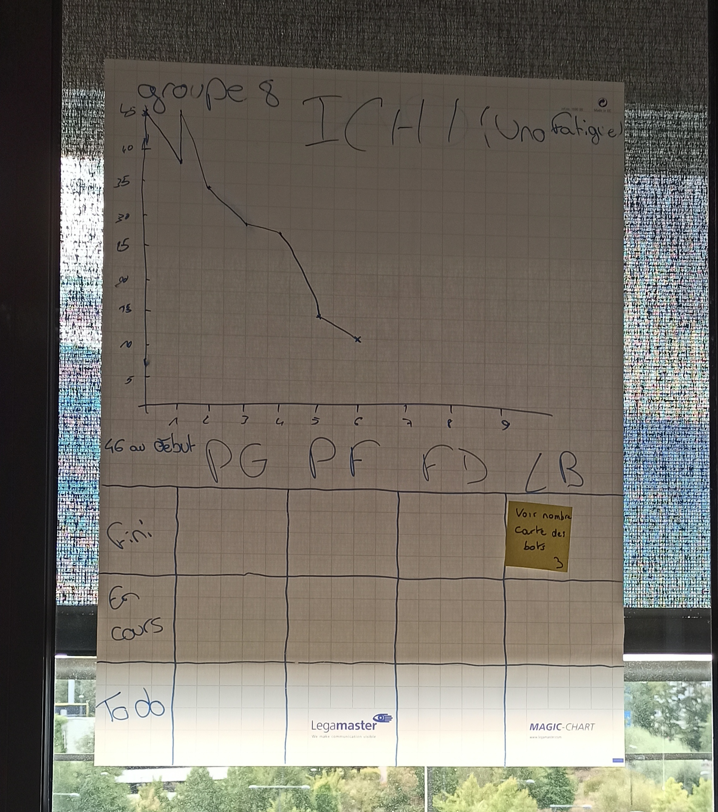
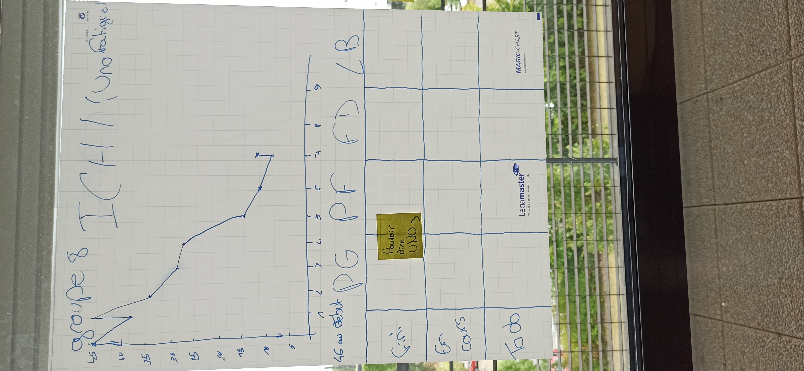
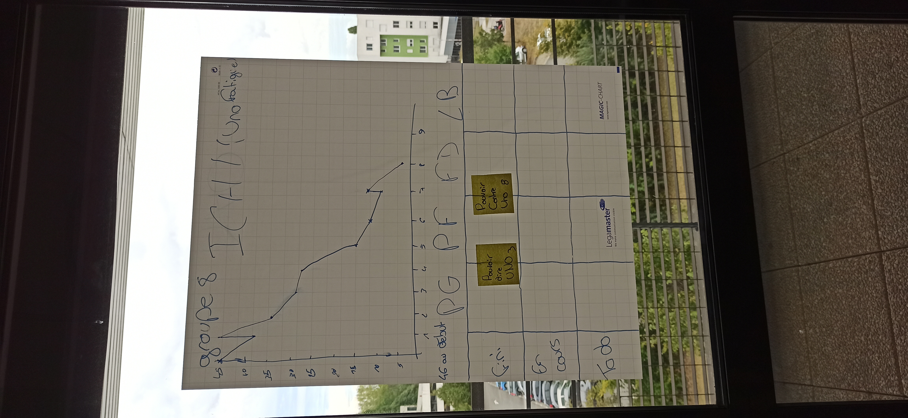
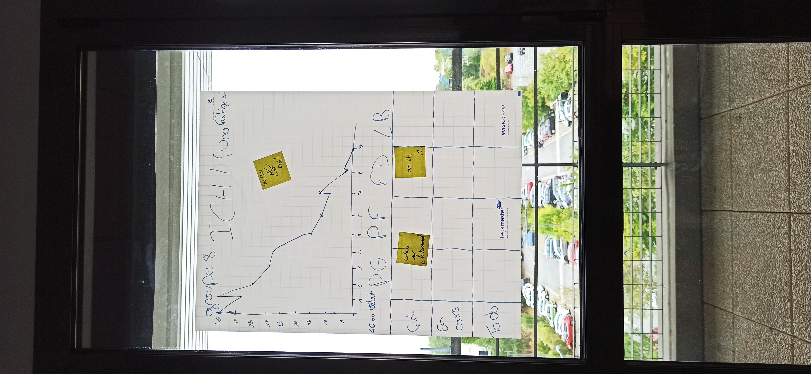

# ICHI
## <u> Le Uno fatigué </u>

> Développé par le groupe 8 :
> -  Delbe Florian
> -  Bedrici Lea
> -  Goujet Pierre
> -  Pirez Leo
> -  Foulon Pierre
>
> https://gitlab.univ-lille.fr/2022-projet-agile-de-rentree/groupe-8

---

## Sprint 1 (Jeudi 1 septembre)

### Démo + Planification du sprint suivant

#### Ce que nous avons fait durant ce sprint :
>- Création et initialisation du dépôt git (Manquant sur le radiateur)
>- Création de toutes les cartes en double dans toutes les couleurs sauf les cartes "Zéro"
>- Distribution des cartes aléatoirement

### Ce que nous allons faire durant le prochain sprint : 
>- Choisir la carte que le joueur veut poser
>- Piocher une carte dans la pioche
>- Cartes présentent dans la main du joueur
>- Indiquer la carte au centre

### Rétrospective
#### Sur quoi avons nous butté ?
>- Conflits GIT
>- Pas d'UML
>
> Nous avons rendu à temps un programme fonctionnel qui affiche toutes les cartes crées

### PDCA
>- S'adapter au fur et à mesure dans le code
>- Communiquer sur les fichiers en cours d'édition 

### Mémo : 

---

## Sprint 2 (Vendredi 2 septembre)

### Démo + Planification du sprint suivant

#### Ce que nous avons fait durant ce sprint :
> - Choix de la carte a poser
> - Piocher une carte
> - Voir les cartes dans sa main
> - Voir la carte au centre

### Ce que nous allons faire durant le prochain sprint : 
> - Créer des ASCII Arts pour rendre le jeu plus visuel
> - Connaitre la couleur de la carte
> - Savoir quel joueur joue

### Rétrospective
#### Sur quoi avons nous butté ?
> - Certains conflits git
> - Pioche aléatoire et incorrecte
>
> Nous avons pu rendre à temps une démo fonctionnelle et donc terminer nos objectifs

### PDCA
> - Résoudre les bugs en communiquant entre nous

### Mémo : 

---

## Sprint 3 (Vendredi 2 septembre)

### Démo + Planification du sprint suivant

#### Ce que nous avons fait durant ce sprint :
> - Préparation des ASCII Arts pour l'affichage des cartes
> - Possibilité de connaitre la couleur de la carte
> - Savoir qui joue

### Ce que nous allons faire durant le prochain sprint : 
> - Régler le système de tour
> - Voir le nombre de cartes des adversaires

### Rétrospective
#### Sur quoi avons nous butté ?
> - Conflits git
> - Affichage des ASCII Arts
>
> Nous avons rendu à temps une démo semi-fonctionnelle avec quelques soucis de boucle

### PDCA
> - Ne pas travailler sur le même fichier en même temps
> - Résoudre les bugs en communiquant entre nous

### Mémo : 

---

## Sprint 4 (Vendredi 2 septembre)

### Démo + Planification du sprint suivant

#### Ce que nous avons fait durant ce sprint :
> - Vérifier si la carte posée par le joueur est valide
> - Système de tour

### Ce que nous allons faire durant le prochain sprint : 
> - Résolution bug IA
> - Trier les cartes

### Rétrospective
#### Sur quoi avons nous butté ?

> - IA qui joue n'importe quoi
>
>Nous avons rendu une démo fonctionnelle malgrès les erreurs avec l'IA

### PDCA
> - Réaliser des tests unitaires sur chaque méthodes pour trouver le bug

### Mémo : 

---

## Sprint 5 (Vendredi 3 septembre)

### Démo + Planification du sprint suivant

#### Ce que nous avons fait durant ce sprint :
> - Résolutions problèmes de tour
> - Moins de bugs d'IA
> - Trier les cartes du deck

### Ce que nous allons faire durant le prochain sprint : 
> - Voir le nombre de cartes des IA

### Rétrospective
#### Sur quoi avons nous butté ?
> - Problème d'accolades
> - IDE déffectueux pour Florian
>
> La démo est fonctionnelle malgrès les quelques bugs de l'IA

### PDCA
> - Faire attention et communiquer les changements dans le code

### Mémo : 

---

## Sprint 6 (Lundi 5 septembre)

### Démo + Planification du sprint suivant

#### Ce que nous avons fait durant ce sprint :
> - Résolution des bugs majeurs
> - Voir le nombre de cartes des adversaires

### Ce que nous allons faire durant le prochain sprint : 
> - Pouvoir dire UNO

### Rétrospective
#### Sur quoi avons nous butté ?
> - Florian à des problèmes d'IDE
>
> La démo est fonctionnelle et rendue à temps

### PDCA
> - Tests unitaires pour detecter les bugs

### Mémo : 

---

## Sprint 7 (Lundi 5 septembre)

### Démo + Planification du sprint suivant

#### Ce que nous avons fait durant ce sprint :
> - Pouvoir annoncer un UNO
> - Résolutions de bugs

### Ce que nous allons faire durant le prochain sprint : 
> - Valider le UNO
> - Pouvoir CONTRE-UNO

### Rétrospective
#### Sur quoi avons nous butté ?
> - Problèmes d'ASCII Arts
> - Aligner les cartes de la main
### PDCA
> - Changer les ASCII Arts

### Mémo : 

---

## Sprint 8 (Lundi 5 septembre)

### Démo + Planification du sprint suivant

### Ce que nous avons fait durant ce sprint :
> - Annoncer le UNO
> - Valider le CONTRE-UNO

### Ce que nous allons faire durant le prochain sprint : 
> - Mettre couleurs dans le terminal
> - Rendre le projet executable facilement

### Rétrospective
#### Sur quoi avons nous butté ?
> - Utilisation simultanée de Timer et de Scanner
> - Problèmes d'input à cause de la console

### PDCA
> - Utilisation des threads

### Mémo : 

---

## Sprint 9 (Lundi 5 septembre)

### Démo + Planification du sprint suivant

### Ce que nous avons fait durant ce sprint :
> - Couleurs efficace dans le terminal
> - Fichier executable 

### Ce que nous allons faire durant le prochain sprint : 
> - Rendre le projet 

### Rétrospective
#### Sur quoi avons nous butté ?
> - Couleurs pour carte spéciale non fonctionnelle

### PDCA
> - Réflexion collective

### Mémo : 

